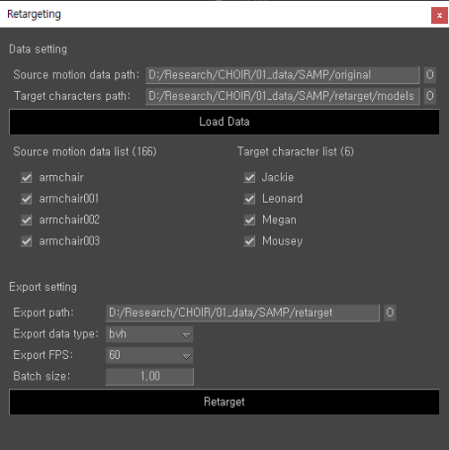

# Motion Retargeter

## Tested Environment
* MotionBuilder 2022 (Python 3)

## Requirements
* Windows OS
* Numpy

## UI

### Data setting
* Enter the path manually or by clicking the "O" button to browse using File Explorer.

### Data list
* If you input the path manually, click the "Load Data" button to load files.
* The number in parentheses indicates the count of loaded files in the provided path.
* Only checked data are used in retargeting

### Export setting
* Export path: Enter the path manually or by clicking the "O" button to browse using File Explorer.
* Export data type: bvh or fbx
* Export FPS: 24, 30, 60, 120
* Batch size: motion batch size to retarget per each target skeleton.
  - Range: 1 ~ (length of source motion data).
  - [__Note__] If source files are large, it is recommended to use a smaller batch size to avoid the memory issue.

## TODO
- [ ] Add codes handling errors such as path typo
- [ ] Add scroll box to both data lists

## References
* https://github.com/sunny-Codes/SAME
* https://github.com/orangeduck/lafan1-resolved
